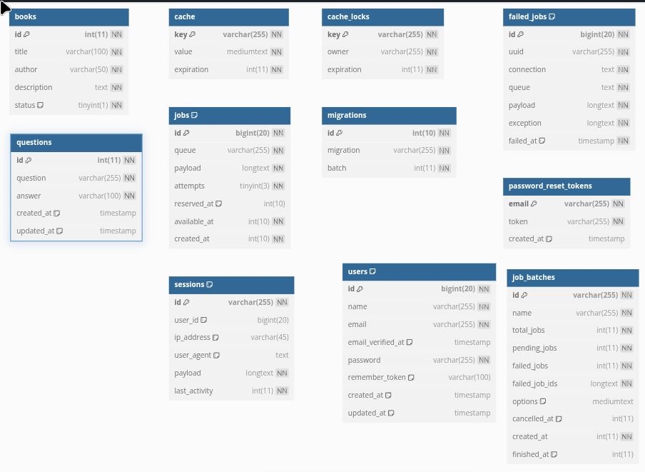

# Entity relationship diagram
This document outlines the core entities required to implement the business logic.

## Key Entities
We provide detailed specifications for:
✅ Books - The primary business entity
✅ Questions - Supporting business entity

## Framework-Managed Entities
The remaining tables (cache, jobs, users, etc.) are:
- Automatically generated by Laravel
- Follow standard framework conventions
- Require no custom business logic modifications

## Database Schema ERD

## Entity Tables

### Books
| Column        | Type         | Constraints               | Description                     |
|---------------|--------------|---------------------------|---------------------------------|
| id            | int(11)      | PK, AUTO_INCREMENT, NOT NULL | Unique book identifier          |
| title         | varchar(100) | NOT NULL                  | Title of the book               |
| author        | varchar(50)  | NOT NULL                  | Author of the book              |
| description   | text         | NOT NULL                  | Detailed book description       |
| status        | tinyint(1)   | NOT NULL, DEFAULT 0       | Availability status (0/1)       |

### Questions
| Column      | Type         | Constraints               | Description                     |
|-------------|--------------|---------------------------|---------------------------------|
| id          | int(11)      | PK, AUTO_INCREMENT, NOT NULL | Question ID                   |
| question    | varchar(255) | NOT NULL                  | Question text                  |
| answer      | varchar(100) | NOT NULL                  | Correct answer                 |
| created_at  | timestamp    | DEFAULT NULL              | Creation timestamp             |
| updated_at  | timestamp    | DEFAULT NULL              | Last update timestamp          |

### Migrations
| Column     | Type         | Constraints               | Description                     |
|------------|--------------|---------------------------|---------------------------------|
| id         | int(10)      | PK, AUTO_INCREMENT, NOT NULL | Migration ID                   |
| migration  | varchar(255) | NOT NULL                  | Migration class name           |
| batch      | int(11)      | NOT NULL                  | Batch number                   |

